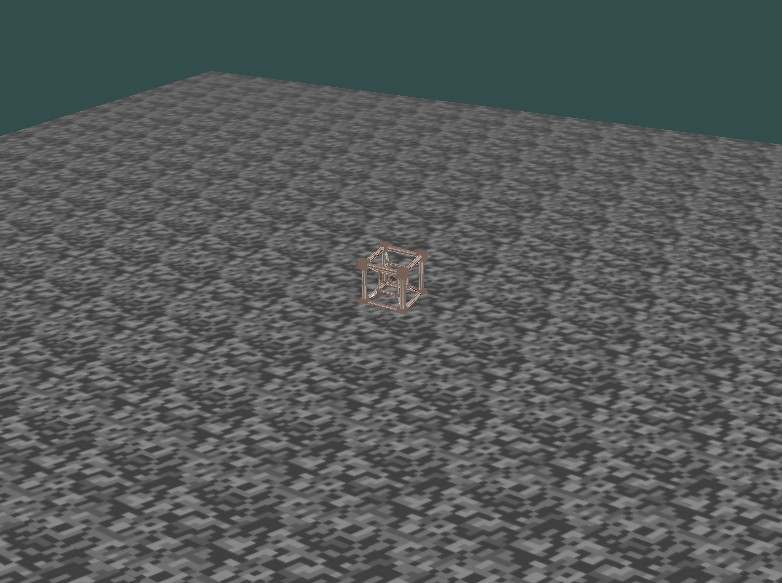

# Projet Moteur 3D

Un moteur 3D simple avec OpenGL (C++) qui inclut une simulation physique, des contrôles de caméra et des capacités de chargement de modèles.

## Vue d'ensemble

Ce projet implémente un moteur 3D basique utilisant OpenGL avec les fonctionnalités suivantes :
- Chargement de modèles (fichiers .obj)
- Mapping de textures
- Simulation physique basique (gravité, collisions, rebonds)
- Contrôles de caméra (mouvement et rotation)
- Système d'éclairage
- Sélection d'objets via raycasting

## Structure du projet

```
3Dengine/
├── bin/
│   ├── main                   # Exécutable compilé
│   └── Makefile               # Script de compilation
├── shaders/
│   ├── vertex_shader.glsl     # Code du shader de vertex
│   └── fragment_shader.glsl   # Code du shader de fragment
├── texture/
│   ├── exemple.obj            # Modèle 3D d'exemple
│   └── texture.jpg               # Texture pour le sol
├── include/
│   ├── glad.h                 # Chargeur OpenGL
│   ├── glfw3.h                # Gestion de fenêtre et d'entrées
│   ├── stb_image.h            # Bibliothèque de chargement d'images
│   ├── glm/                   # Bibliothèque mathématique
│   ├── Camera.h               # Classe Camera
│   └── Shader.h               # Classe Shader
├── src/
│   ├── main.cpp               # Code principal de l'application
│   └── glad.c                 # Implémentation de GLAD
└── lib/
    └── glfw3.dll              # Bibliothèque dynamique GLFW
```

## Dépendances

- GLFW (OpenGL Framework) - Pour la création de fenêtre et la gestion des entrées
- GLAD - Chargeur OpenGL
- GLM (OpenGL Mathematics) - Pour les opérations matricielles et vectorielles
- STB Image - Pour le chargement des textures

## Instructions d'installation

1. **Cloner le dépôt**
   ```
   git clone https://github.com/votreutilisateur/3dengine.git
   cd 3dengine
   ```

2. **Installer les dépendances**
   
   Vous devez télécharger et installer les bibliothèques suivantes :
   - GLFW : https://www.glfw.org/download.html
   - GLM : https://github.com/g-truc/glm/releases
   - Copiez le fichier `glfw3.dll` dans le dossier lib

3. **Compiler le projet**
   
   Utilisez le Makefile fourni pour compiler le projet :
   ```
   cd bin
   make all
   ```
   
   Le Makefile contient la commande suivante :
   ```
   g++ -g --std=c++17 -I../include -I../include/glm -L../lib ../src/*.cpp ../src/glad.c -lglfw3dll -o main
   ```

4. **Configurer les chemins**
   
   Dans le fichier main.cpp, modifiez les chemins pour qu'ils correspondent à votre système :
   ```cpp
   Shader shader("chemin/vers/vertex_shader.glsl", "chemin/vers/fragment_shader.glsl");
   if (!loadOBJ("chemin/vers/exemple.obj")) return -1;
   GLuint texture = loadTexture("chemin/vers/tex2.jpeg");
   GLuint groundTexture = loadTexture("chemin/vers/text.jpg");
   ```

5. **Exécuter le programme**
   
   Après compilation, exécutez le programme depuis le dossier bin :
   ```
   ./main
   ```

## Le Moteur Graphique : 



## Utilisation

### Contrôles

- **Mode Mouvement (Par défaut)** :
  - W : Avancer
  - S : Reculer
  - A : Aller à gauche
  - D : Aller à droite
  - Souris : Regarder autour

- **Mode Curseur** :
  - U : Basculer entre le mode Mouvement et le mode Curseur
  - Touches fléchées : Rotation de la caméra
  - Bouton gauche de la souris : Sélectionner des objets (raycasting)

### Physique

Le moteur inclut un système physique basique avec :
- Gravité (ajustable dans la structure `PhysicsProperties`)
- Détection et résolution des collisions
- Rebonds avec coefficient de restitution

### Ajouter vos propres modèles

1. Créez ou téléchargez un fichier modèle OBJ
2. Placez-le dans le répertoire `texture/`
3. Mettez à jour le chemin dans le fichier `main.cpp` :
   ```cpp
   if (!loadOBJ("chemin/vers/votre/modele.obj")) return -1;
   ```

### Ajouter vos propres textures

1. Préparez vos fichiers de texture (JPEG, PNG)
2. Placez-les dans le répertoire `texture/`
3. Mettez à jour le chemin dans le fichier `main.cpp` :
   ```cpp
   GLuint texture = loadTexture("chemin/vers/votre/texture.jpg");
   ```

## Fonctionnalités

### Système de caméra

- Caméra à la première personne avec contrôle par souris
- Basculement entre les modes mouvement et curseur
- Vitesse de déplacement et sensibilité configurables

### Système physique

- Simulation de la gravité
- Détection des collisions avec le sol
- Mécanique de rebond avec restitution ajustable

### Rendu

- Rendu basé sur les shaders
- Mapping de textures
- Système d'éclairage basique (commenté dans le fragment shader)

### Gestion des entrées

- Traitement des entrées clavier et souris
- Changement de mode (mouvement/curseur)

## Dépannage

- **Erreurs de DLL manquante** : Assurez-vous que la DLL GLFW est au bon endroit
- **Erreurs de compilation de shader** : Vérifiez les chemins des shaders et le code des shaders
- **Problèmes de chargement de texture** : Vérifiez que les chemins des textures sont corrects et que les fichiers existent
- **Problèmes de chargement de modèle** : Assurez-vous que le fichier OBJ est correctement formaté et contient des coordonnées de texture
- **Erreurs de compilation** : Vérifiez que toutes les dépendances sont correctement installées et que les chemins sont corrects dans le Makefile

## Améliorations futures

- Ajouter une physique plus avancée (rotation, friction)
- Implémenter le shadow mapping
- Ajouter le support pour d'autres formats de modèles (FBX, GLTF)
- Implémenter un graphe de scène pour une meilleure gestion des objets
- Ajouter des techniques d'éclairage plus avancées

Auteur : Eyub Celebioglu
